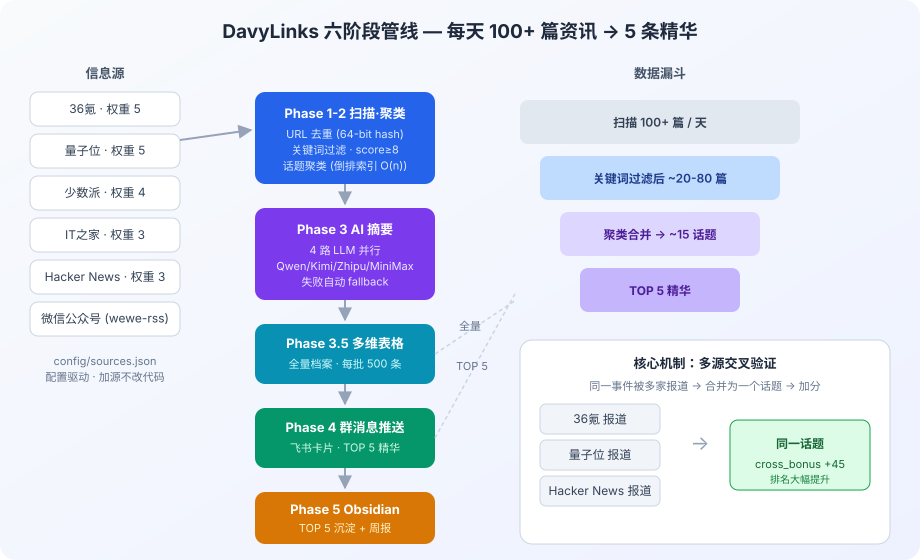
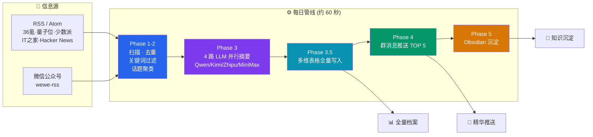
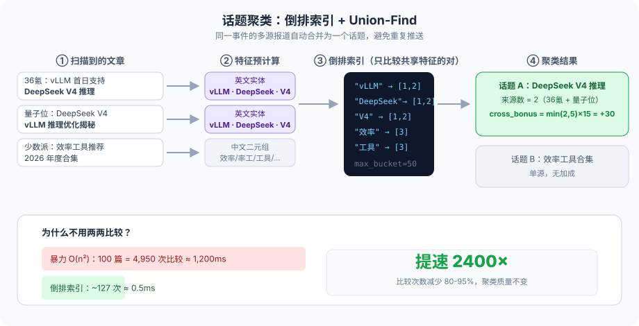
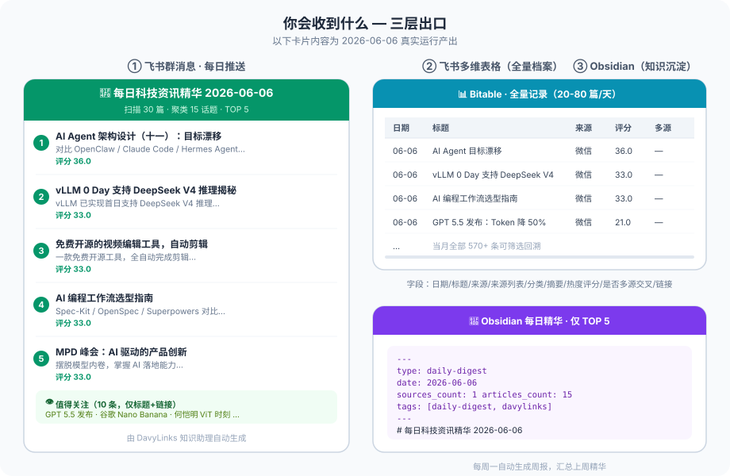
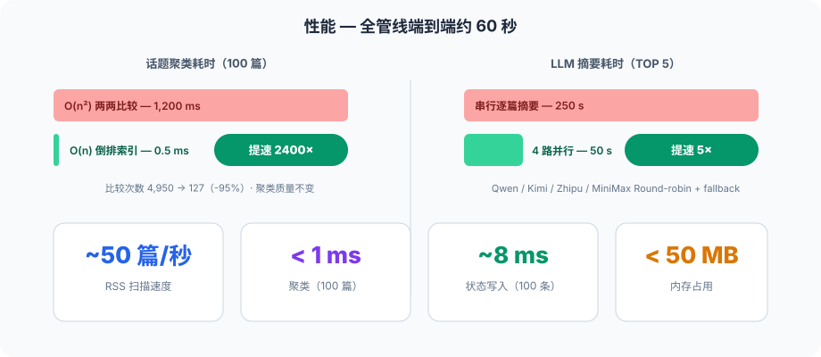

<div align="center">

# 🗞️ DavyLinks 知识助理

**自动化科技资讯聚合管线 — 每天 100+ 篇资讯，浓缩为 5 条最值得看的内容**

[](https://www.python.org/)
[](#-质量保障)
[](#license)
[](https://open.feishu.cn/)
[](https://obsidian.md/)



[快速开始](#-快速开始) · [它是怎么工作的](#-它是怎么工作的) · [你会收到什么](#-你会收到什么) · [设计报告](docs/design/design-report.md) · [架构决策 (ADR)](knowledge/decisions/README.md)

</div>

---

## 💡 为什么需要 DavyLinks

每天科技资讯散落在十几个平台，人工跟踪的成本越来越高：

| 😫 痛点 | ✅ DavyLinks 的方案 |
|---------|---------------------|
| 来源分散：36氪、量子位、少数派、Hacker News、微信公众号…… 逐一看不完 | **配置驱动多源聚合**——在 `sources.json` 加一行即可接入新源，无需改代码 |
| 中文 RSS 生态萎缩：机器之心、虎嗅、InfoQ 相继关停 RSS，微信公众号完全封闭 | **混合接入**：原生 RSS 优先 + [wewe-rss](https://github.com/easychen/wewe-rss) 补微信公众号 |
| 重复轰炸：同一热点被 5 家源反复报道 | **话题聚类 + 多源交叉验证**——同话题自动合并，被多家报道反而加分，重要的事排前面 |
| 转瞬即逝：群消息里看过的文章，一周后找不回来 | **三层出口**：飞书表格存全量档案可回溯，群消息推精华，Obsidian 沉淀长期知识 |

## 🏗️ 它是怎么工作的



**一次运行的完整数据漏斗**：扫描 100+ 篇 → 关键词过滤剩 20-80 篇 → 聚类合并为约 15 个话题 → AI 摘要排序 → 每日 TOP 5。

### 核心机制：多源交叉验证

> **被多家媒体同时报道，本身就是重要性的最强信号。**

同一话题被越多来源报道，`cross_bonus = min(来源数, 5) × 15` 加成越高，排名越靠前。这让管线不需要人工编辑，也能把"真正的大事"顶到最上面。

## 🧠 聚类算法：怎么识别"同一件事"

倒排索引 + Union-Find，用英文实体名和中文二元组做特征，只比较有共享特征的文章对——比较次数减少 **80-95%**，聚类质量不降：



**相关性评分**（决定谁能进入后续流程）与**最终排序**（决定 TOP 5）：

```
score = source_weight × 2 + title_matches × 3 + content_matches × 1 + recency_bonus
        └── 权重5的源自带10分底分        24h内+5 · 48h内+3 · 72h内+1

final_score = relevance_score + quality_rating × 2 + cross_bonus
                                                  └── 多源交叉验证加成
```

## 📦 你会收到什么

三个出口各司其职——**完整档案、日常阅读、长期沉淀**。下图为 2026-06-06 真实运行产出的样式还原：



<details>
<summary>📄 点开查看真实产出的 Obsidian 每日笔记（节选）</summary>

```markdown
# 每日科技资讯精华 2026-06-06

## TOP 5

### 1. AI Agent 架构设计（十一）：目标漂移（OpenClaw、Claude Code、Hermes Agent 对比）
> [!info] 摘要
> 本文对比OpenClaw、Claude Code与Hermes Agent，探讨AI架构中的目标漂移问题及应对策略。

| 属性 | 值 |
|------|-----|
| 来源 | 微信公众号 |
| 评分 | 36.0 |
| 链接 | [mp.weixin.qq.com/s/Nr2M0opB…](https://mp.weixin.qq.com/s/Nr2M0opBL30fKXQoF1Sn7g) |

### 2. vLLM 0 Day 支持 DeepSeek V4 推理揭秘
> [!info] 摘要
> vLLM已实现首日支持DeepSeek V4推理，本文揭秘其技术实现与优化细节。

## 值得关注
- **Anthropic 产品负责人：从 6 个月到 1 天的发版秘密**
- **谷歌这把「香蕉」太狠了！何恺明等引爆视觉 Transformer 时刻**
- **GPT 5.5 发布：Token 消耗直降 50%**
---
*由 DavyLinks 知识助理自动生成*
```

</details>

终端运行时也能看到完整的管线统计：

```text
$ .venv/bin/python scripts/pipeline.py

INFO  scan_articles  - 预计算 30 篇文章的实体和二元组...
INFO  scan_articles  - 实体索引：18 个实体，覆盖 22 篇文章
INFO  scan_articles  - 候选比较对：41 对 (原始 O(n²)=435)
INFO  scan_articles  - 实际比较次数：41 (节省 90.6%)
INFO  summarize      - 4 路 LLM 并行摘要完成 (Qwen/Kimi/Zhipu/MiniMax)
INFO  feishu_bitable - 写入飞书多维表格 15 条
INFO  push_feishu    - 飞书卡片推送成功
INFO  save_obsidian  - 已保存: ObsidianWiki/知识助理/每日精华/2026-06-06.md
INFO  pipeline       - 扫描 30 · 过滤 15 · 推送 5 · 耗时 58.3s
```

## 📈 性能



## 🚀 快速开始

```bash
# 1. 安装依赖（Python 3.9+）
python3 -m venv .venv
.venv/bin/python -m pip install -r requirements.txt

# 2. 配置密钥：飞书凭证 + LLM API Key + Obsidian 路径
cp config/secrets.example.yaml config/secrets.yaml && vim config/secrets.yaml

# 3. 预览运行（不推送、不保存）
.venv/bin/python scripts/pipeline.py --dry-run

# 4. 正式运行
.venv/bin/python scripts/pipeline.py
```

<details>
<summary>🔧 更多运行模式</summary>

```bash
.venv/bin/python scripts/pipeline.py --skip-push   # 跳过飞书推送
.venv/bin/python scripts/pipeline.py --skip-save   # 跳过 Obsidian 保存
.venv/bin/python scripts/pipeline.py --cleanup     # 清理 90 天前旧数据
.venv/bin/python scripts/state_db.py               # 查看运行统计
sh scripts/check.sh                                # 编译 + 全部测试
```

定时任务（每天 8:00）：

```bash
crontab -e
# 0 8 * * * cd /path/to/DavyLinks && .venv/bin/python scripts/pipeline.py >> ~/.davylinks/cron.log 2>&1
```

</details>

<details>
<summary>⚙️ 配置示例（信息源与密钥）</summary>

**`config/sources.json`** — 信息源与关键词（配置驱动，加源不改代码）：

```json
{
  "sources": [
    {
      "name": "量子位",
      "url": "https://www.qbitai.com/feed",
      "category": "AI资讯",
      "weight": 5,
      "keywords": ["AI", "大模型", "LLM"]
    }
  ],
  "global_keywords": ["AI", "LLM", "开源", "效率"]
}
```

**`config/secrets.yaml`** — 凭证（不提交 git，支持环境变量覆盖）：

```yaml
feishu:
  app_id: "cli_xxx"
  app_secret: "xxx"
  webhook_url: "https://open.feishu.cn/open-apis/bot/v2/hook/xxx"
  bitable: { app_token: "bascnxxx", table_id: "tblxxx" }

llm_providers:
  qwen: { api_key: "sk-xxx", model: "qwen-plus" }
  kimi: { api_key: "xxx",   model: "moonshot-v1-8k" }

obsidian:
  vault_path: "/Users/you/ObsidianWiki"
```

</details>

## 🛡️ 质量保障

| 维度 | 机制 |
|------|------|
| **测试** | 19 个用例：配置加载、管线编排、聚类算法、数据库、不可变性保证 |
| **不可变数据流** | 各阶段函数返回新 dict、不修改输入，7 个专项测试强制保证 |
| **SQL 安全** | 全部参数化查询，杜绝注入 |
| **密钥安全** | 零硬编码，延迟加载（import 时不读 secrets） |
| **故障韧性** | 4 路 LLM 自动 fallback，单源失败不阻塞管线 |

## 📚 文档

| 文档 | 内容 |
|------|------|
| 📋 [设计报告](docs/design/design-report.md) | **全面理解本项目从这里开始**——业务背景、架构、决策、规划 |
| 🏛️ [架构文档](docs/architecture/) | 管线详解、聚类算法、摘要机制、数据流 |
| 📖 [使用指南](docs/guides/) | 快速上手、配置、飞书/Obsidian 接入、故障排查 |
| 🧠 [架构决策 ADR](knowledge/decisions/README.md) | 8 条核心设计决策的背景与权衡 |
| 🌏 [领域知识库](knowledge/README.md) | RSS 生态、LLM 选型、飞书/Obsidian 实践 |
| 📜 [CHANGELOG](CHANGELOG.md) | 版本变更记录 |

## 🔗 相关项目

| 项目 | 关系 |
|------|------|
| **[Davybase](https://github.com/davyzhong/davybase)** | 姊妹项目：私有笔记管理，共享同一 Obsidian vault 与飞书通知基础设施 |
| **blogwatcher-cli** | RSS 抓取引擎 |
| **wewe-rss** | 微信公众号转 Atom feed |
| **Hermes Agent** | 定时任务调度 |

## License

MIT
