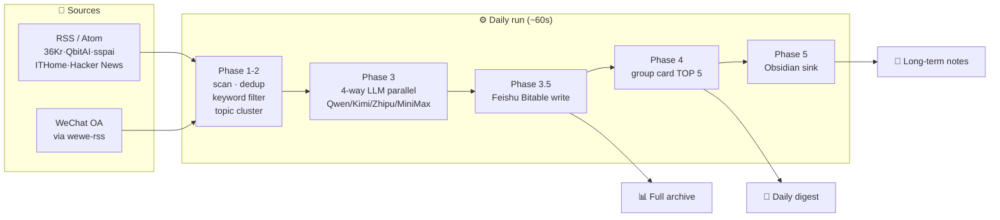

<div align="center">

# 🗞️ DavyLinks · Knowledge Assistant


**Automated tech-news aggregation pipeline — 100+ articles/day distilled to the 5 most-mentioned stories.**
RSS + WeChat in, Feishu + Obsidian out.

**Languages**: [English](./README.md) · [中文](./README.en.md)

[](https://www.python.org/)
[](#-quality)
[](#-license)
[](https://open.feishu.cn/)
[](https://obsidian.md/)


[Quick Start](#-quick-start) · [How it Works](#-how-it-works) · [What you get](#-what-you-get) · [Design Report](docs/design/design-report.md) · [ADRs](knowledge/decisions/README.md)

</div>

---

## 🎯 What this solves

Tech news sprawls across a dozen platforms — tracking it manually is unsustainable:

| 😫 Pain | ✅ DavyLinks's answer |
|---------|----------------------|
| **Sources everywhere**: 36Kr, QbitAI, sspai, Hacker News, WeChat Official Accounts — too many to read | **Config-driven aggregation** — add a row to `sources.json`, no code change |
| **Chinese RSS shrinking**: Jiqizhixin, Huxiu, InfoQ shut down RSS; WeChat is fully closed | **Hybrid ingest**: native RSS first + [wewe-rss](https://github.com/easychen/wewe-rss) for WeChat |
| **Repetition fatigue**: one hot story gets reported by 5 outlets | **Topic clustering + cross-source scoring** — more outlets covering = higher rank |
| **Transient signal**: a great read in chat disappears in a week | **Three-sink output** — Feishu table for archive, group card for daily read, Obsidian for long-term knowledge |

## 🏗️ How it works



**Daily funnel**: scan 100+ → keyword filter 20-80 → cluster ~15 topics → AI summary → **TOP 5 daily**.

### Core mechanism: cross-source verification

> **The strongest signal of importance is being covered by multiple outlets.**

Each cluster gets `cross_bonus = min(outlet_count, 5) × 15`. A story covered by 5 different outlets automatically outranks a single-outlet exclusive — no human editor needed.

## 🧠 Clustering algorithm

Inverted index + Union-Find. English entities and Chinese bigrams as features. Only compare article pairs sharing at least one feature — comparison count drops **80-95%** without quality loss.


```
score = source_weight × 2 + title_matches × 3 + content_matches × 1 + recency_bonus
        └── weight-5 sources carry 10 base        24h+5 · 48h+3 · 72h+1

final_score = relevance_score + quality_rating × 2 + cross_bonus
                                                └── multi-source boost
```

## 📦 What you get

Three sinks, three purposes — **archive, daily read, long-term knowledge**. Screenshot from a 2026-06-06 real run:


<details>
<summary>📄 View real Obsidian daily note (excerpt)</summary>

```markdown
# Daily Tech Highlights 2026-06-06

## TOP 5

### 1. AI Agent Architecture (XI): Goal Drift (OpenClaw, Claude Code, Hermes Agent)
> [!info] Summary
> Comparison of OpenClaw, Claude Code, and Hermes Agent on goal-drift patterns
> and mitigation strategies in AI architectures.

| Field | Value |
|-------|-------|
| Source | WeChat OA |
| Score | 36.0 |
| Link | [mp.weixin.qq.com/s/Nr2M0opB…](https://mp.weixin.qq.com/s/Nr2M0opBL30fKXQoF1Sn7g) |

### 2. vLLM Day-0 Support for DeepSeek V4 Inference
> [!info] Summary
> How vLLM ships DeepSeek V4 inference on day zero — implementation details
> and optimization walkthrough.

## Worth watching
- **Anthropic product lead: from 6-month to 1-day release cycle**
- **Google's "banana" is too strong — He Kaiming et al. ignite a Vision Transformer moment**
- **GPT 5.5 release: token consumption cut by 50%**
---
*Auto-generated by DavyLinks Knowledge Assistant*
```

</details>

Pipeline stats from a real terminal run:

```text
$ .venv/bin/python scripts/pipeline.py

INFO  scan_articles  - pre-computing entities and bigrams for 30 articles...
INFO  scan_articles  - entity index: 18 entities covering 22 articles
INFO  scan_articles  - candidate pairs: 41 (raw O(n²)=435)
INFO  scan_articles  - actual comparisons: 41 (saved 90.6%)
INFO  summarize      - 4-way LLM parallel done (Qwen/Kimi/Zhipu/MiniMax)
INFO  feishu_bitable - wrote 15 rows to Feishu Bitable
INFO  push_feishu    - Feishu card sent successfully
INFO  save_obsidian  - saved: ObsidianWiki/知识助理/每日精华/2026-06-06.md
INFO  pipeline       - scanned 30 · filtered 15 · pushed 5 · 58.3s
```

## 📈 Performance


## 🚀 Quick start

```bash
# 1. Install (Python 3.9+)
python3 -m venv .venv
.venv/bin/python -m pip install -r requirements.txt

# 2. Configure: Feishu creds + LLM API keys + Obsidian vault path
cp config/secrets.example.yaml config/secrets.yaml && vim config/secrets.yaml

# 3. Dry-run preview (no push, no save)
.venv/bin/python scripts/pipeline.py --dry-run

# 4. Real run
.venv/bin/python scripts/pipeline.py
```

<details>
<summary>🔧 More run modes</summary>

```bash
.venv/bin/python scripts/pipeline.py --skip-push   # skip Feishu card
.venv/bin/python scripts/pipeline.py --skip-save   # skip Obsidian save
.venv/bin/python scripts/pipeline.py --cleanup     # purge 90-day-old rows
.venv/bin/python scripts/state_db.py               # show run statistics
sh scripts/check.sh                                # compile + full test
```

Cron (daily at 8:00):

```bash
crontab -e
# 0 8 * * * cd /path/to/DavyLinks && .venv/bin/python scripts/pipeline.py >> ~/.davylinks/cron.log 2>&1
```

</details>

<details>
<summary>⚙️ Config example (sources + credentials)</summary>

**`config/sources.json`** — sources and keywords (config-driven, no code change):

```json
{
  "sources": [
    {
      "name": "QbitAI",
      "url": "https://www.qbitai.com/feed",
      "category": "AI News",
      "weight": 5,
      "keywords": ["AI", "LLM", "large model"]
    }
  ],
  "global_keywords": ["AI", "LLM", "open source", "productivity"]
}
```

**`config/secrets.yaml`** — credentials (not in git, env vars override):

```yaml
feishu:
  app_id: "cli_xxx"
  app_secret: "xxx"
  webhook_url: "https://open.feishu.cn/open-apis/bot/v2/hook/xxx"
  bitable: { app_token: "bascnxxx", table_id: "tblxxx" }

llm_providers:
  qwen: { api_key: "sk-xxx", model: "qwen-plus" }
  kimi: { api_key: "xxx",   model: "moonshot-v1-8k" }

obsidian:
  vault_path: "/Users/you/ObsidianWiki"
```

</details>

## 🛡️ Quality

| Dimension | Mechanism |
|-----------|-----------|
| **Tests** | 19 cases: config loading, pipeline orchestration, clustering, DB, immutability guarantees |
| **Immutable data flow** | Each phase returns a new dict, never mutates input — 7 dedicated tests enforce this |
| **SQL safety** | Fully parameterized queries — no string interpolation |
| **Credential safety** | Zero hard-coding, lazy-loaded (not read at import time) |
| **Fault resilience** | 4-way LLM auto-fallback — one source failing never blocks the pipeline |

## 📚 Documentation

| Doc | Content |
|-----|---------|
| 📋 [Design Report](docs/design/design-report.md) | **Start here** — background, architecture, decisions, roadmap |
| 🏛️ [Architecture](docs/architecture/) | Pipeline detail, clustering, summarization, data flow |
| 📖 [User Guides](docs/guides/) | Quickstart, config, Feishu/Obsidian setup, troubleshooting |
| 🧠 [ADRs](knowledge/decisions/README.md) | 8 core design decisions + rejected options |
| 🌏 [Domain KB](knowledge/README.md) | RSS ecosystem, LLM selection, Feishu/Obsidian practice |
| 📜 [CHANGELOG](CHANGELOG.md) | Version history |

## 🔗 Related projects

| Project | Relationship |
|---------|--------------|
| **[Davybase](https://github.com/davyzhong/davybase)** | Sibling project: private note management; shares Obsidian vault + Feishu notification infra |
| **blogwatcher-cli** | RSS fetch engine |
| **wewe-rss** | WeChat OA → Atom feed |
| **Hermes Agent** | Scheduled-task dispatcher |

## 📄 License

MIT

---

<sub>📸 Screenshots auto-generated by GitHub Actions（<a href=".github/workflows/screenshot.yml">view workflow</a>）— readme-craft v3.0.0-alpha.0 T18</sub>